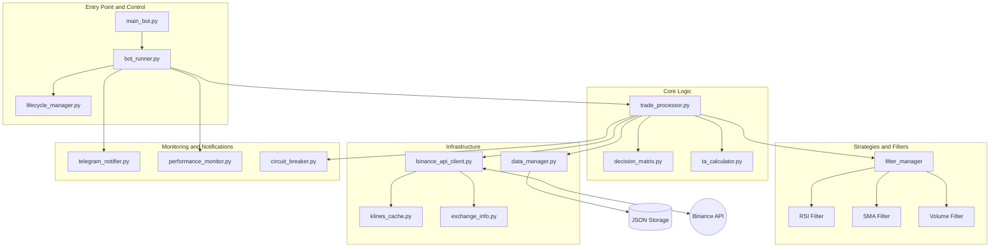
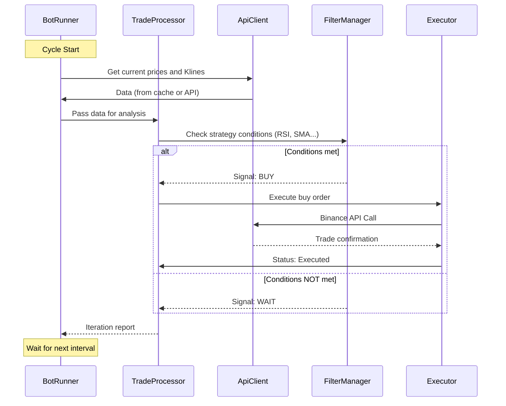

# 🗺️ Extended Technical Map of the Binance Bot Project

This document provides a deep overview of the architecture, operational logic, and interaction of the trading bot components.

---

## 🏗️ 1. System Architecture

The bot is built with a modular architecture, where each component has a clearly defined area of responsibility.

---

## 🔄 2. Trading Iteration Cycle (Workflow)

Each bot operation cycle (default every 60s) goes through the following stages:

---

## 📊 3. Module Details

### 🛡️ Security and Error Handling
*   **`circuit_breaker.py`**: Protects your deposit. If the bot receives too many API errors in a row, the "circuit breaker" disables trading for a certain time to avoid bans or chaotic trades.
*   **`error_handler.py`**: Classifies errors into "critical" (bot stop) and "temporary" (retry).
*   **`sanitizer.py`**: Ensures that API keys or secret data never end up in your logs, even if an error occurs.

### 🧠 Strategic Thinking
*   **`decision_matrix.py`**: Mathematical model that weighs signals from different indicators to make the final decision.
*   **`ta_calculator.py`**: Uses libraries (e.g., `pandas`) to calculate technical indicators (RSI, Bollinger Bands, SMA).
*   **`dynamic_tp_sl.py`**: Calculates profit targets (Take Profit) and loss limits (Stop Loss) not just in percentages, but based on market volatility (e.g., via ATR).

### 📂 Data Management
*   **`data_manager.py`**: Ensures "atomic" file writes. This means that if the computer shuts down during writing `positions.json`, the old file won't be corrupted.
*   **`klines_cache.py`**: Saves your API limit. The bot stores candles in memory and updates only the latest one, instead of downloading the entire history each time.

---

## 💾 4. Data Flows

| Data Type | Where Stored | Update Frequency | Purpose |
| :--- | :--- | :--- | :--- |
| **API Keys** | `.env` | Once at startup | Authorization |
| **Prices (Klines)** | RAM (Cache) | Every iteration | Technical Analysis |
| **Positions** | `data/*.json` | On buy/sell | Asset Accounting |
| **Configuration** | `config/*.json` | At startup | Bot Settings |
| **Metrics** | `data/metrics/` | Every 10-60 min | Performance Analysis |

---

## 🛠️ 5. Detailed Overview of Auxiliary Tools

### 🧹 `scripts/` Directory — Maintenance and Verification
Utilities for the daily work of the developer and system administrator of the bot.

| File | Category | Purpose |
| :--- | :--- | :--- |
| **`clean_testnet_logs.py`** | Maintenance | Quick testnet state reset: deletes logs and position JSON files in `data/testnet`. |
| **`backup_data.py`** | Maintenance | Creates backups of critical data files (`positions.json` etc.) before major changes. |
| **`smoke_test_runner.py`** | Diagnostics | "Smoke test": checks bot startup and basic API response without conducting trades. |
| **`test_logging_integration.py`** | Diagnostics | Checks if logging, secret filtering, and key masking work correctly. |
| **`validate_thread_safety.py`** | Diagnostics | Checks for "Race Conditions" when the bot runs in multi-threaded mode. |
| **`setup_linux.sh`** | Setup | Automates `venv` creation and dependency installation on Ubuntu. |
| **`verify_stage1.sh` / `.ps1`** | Verification | Comprehensive check of architectural requirements for the first development stage. |
| **`verify_data_paths.py`** | Verification | Checks access rights to `logs/` and `data/` folders before startup. |

---

### 🔬 `tools/` Directory — Deep Analytics and QA
Tools for ensuring quality (Quality Assurance) and performance analysis.

#### 📊 Performance and Benchmarks
*   **`benchmark.py`**: Main tool for stress testing. Measures processing delays (latency) for thousands of quotes.
*   **`benchmark/` (directory)**: Contains "golden" (baseline) results for comparing performance after updates.

#### 🔍 Static and Dynamic Analysis
*   **`mainnet_readiness_analyzer.py`**: Specialized linter that checks code for hardcoded values, unprotected calls, and other risks before Mainnet.
*   **`detect_cycles.py`**: Analyzes the project's import graph to detect and avoid cyclic dependencies (`A -> B -> A`).
*   **`validate_config.py`**: Checks `config.json` for logical errors (e.g., Stop Loss greater than Take Profit).

#### 🛡️ Audit and Integration
*   **`audit/` (directory)**: Stores reports of automated security checks and code standards compliance.
*   **`integration/` (directory)**: Scripts for checking interaction with specific external services (Telegram, Proxy, etc.).

---

## 📂 6. Hidden and System Folders
*   **`.venv` / `.venv-win`**: Python virtual environments.
*   **`.kiro`**: Project specifications and tasks.
*   **`.obsidian`**: Knowledge base/notes settings.
*   **`.vscode`**: VS Code editor settings.
*   **`.pytest_cache` / `.mypy_cache`**: Temporary caches to speed up tests and analysis.

---
**Report Compiled:** 2025-12-27  
**Documentation Version:** 2.1 (Scripts & Tools Deep-dive)
