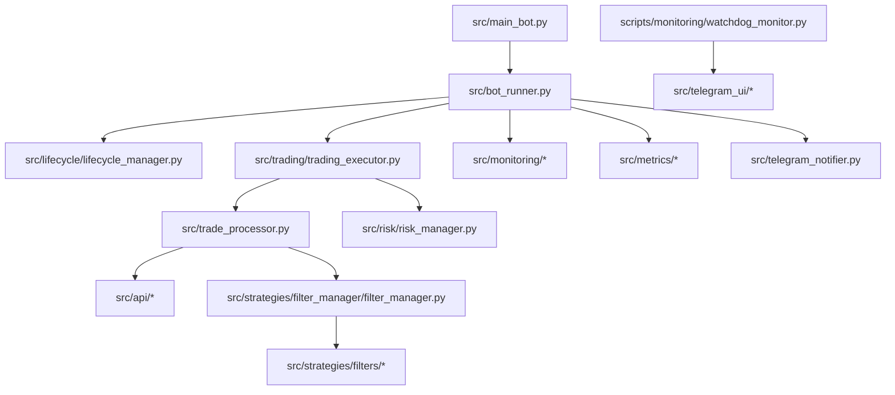

# Extended Project Map (EN)

Updated: 2026-02-28
Target runtime: private `BinaceBot`

## 1. High-Level Architecture

```mermaid
graph TD
    A[src/main_bot.py] --> B[src/bot_runner.py]
    B --> C[src/lifecycle/lifecycle_manager.py]
    B --> D[src/trading/trading_executor.py]
    D --> E[src/trade_processor.py]
    D --> F[src/risk/risk_manager.py]
    E --> G[src/api/*]
    E --> H[src/strategies/filter_manager/filter_manager.py]
    H --> I[src/strategies/filters/*]
    B --> J[src/monitoring/*]
    B --> K[src/metrics/*]
    B --> L[src/telegram_notifier.py]
    M[scripts/monitoring/watchdog_monitor.py] --> N[src/telegram_ui/*]
```

## 2. Runtime Entry and Control

- `src/main_bot.py`
- Parses CLI and loads config/strategy files.
- Initializes logging, lockfile, and bot context.
- Boots `BotRunner` and delegates lifecycle.

- `src/bot_runner.py`
- Main iteration coordinator.
- Handles periodic maintenance:
  - metrics snapshot,
  - balance snapshot,
  - illiquid cleanup.

- `src/lifecycle/lifecycle_manager.py`
- Startup/shutdown orchestration.
- Runtime status synchronization.

## 3. Trading Pipeline

Primary orchestrator: `src/trading/trading_executor.py`.

Iteration flow:

1. `market_fetch` phase (prices + balances).
2. Reprice active positions.
3. SELL checks.
4. Optional post-sell balance refresh.
5. BUY checks.
6. Persistence.
7. Decision summary + runtime KPI logging.

Behavioral note: SELL pass runs before BUY pass.

## 4. Strategy and Execution Layer

- `src/trade_processor.py`
- Entry checks, exit triggers, TP/SL handling.
- Uses strategy-owned settings from `config/strategy*.json`.

- `src/strategies/filter_manager/filter_manager.py`
- Composes filter modules.

- `src/strategies/filters/*`
- `rsi_filter.py`
- `sma_filter.py`
- `atr_filter.py`
- `volume_filter.py`

- `src/api/*`
- Exchange info and symbol filters.
- Klines cache and market data retrieval.
- Spot/Convert execution adapters.

## 5. Portfolio Risk Layer

- `src/risk/risk_manager.py`
- Deterministic policy engine for BUY decisions.
- Modes: `off`, `shadow`, `enforce`.
- Supports:
  - max open positions,
  - max total exposure,
  - near-SL guard,
  - per-group limits,
  - reduce-size decisions.

- Risk config source: `config/config.json -> risk_manager`.

## 6. Feature Flags (Rollout Controls)

Canonical flags:

- `freeze_dynamic_tp_sl`
- `strict_min_notional_enforcement`
- `use_closed_candles_for_signals`
- `intelligent_illiquid_unlocking`

Status note:
- Flags exist in runtime contract.
- Some paths are still compatibility/preview guarded.

## 7. Data and Persistence Contracts

- `data/{mainnet|testnet}/positions.json`
- `data/{mainnet|testnet}/illiquid_positions.json`
- `data/{mainnet|testnet}/heartbeat.json`
- `data/{mainnet|testnet}/runtime_status.json`
- `data/metrics/{mainnet|testnet}/*`

Purpose:
- Recover state between restarts.
- Enable watchdog and Telegram monitoring even when bot process is down.

## 8. Telegram Control Plane

Watchdog process:

- `scripts/monitoring/watchdog_monitor.py`
- `scripts/monitoring/telegram_commands.py`

UI layer:

- `src/telegram_ui/commands.py`
- `src/telegram_ui/command_handlers/*`
- `src/telegram_ui/handlers/*`

Core commands:

- Process: `/start_bot`, `/stop_bot`, `/restart_bot`, `/check_bot`, `/reload_config`
- Monitoring: `/status`, `/positions`, `/balance`, `/health`, `/performance`, `/report`, `/illiquid`

## 9. Testing Surface

Observed test inventory in private repo:

- Test modules: `120`
- Property test modules: `31`

Coverage areas include:
- risk manager contract,
- feature-flag contract,
- trading execution guards,
- config validation,
- Telegram and watchdog flows.
