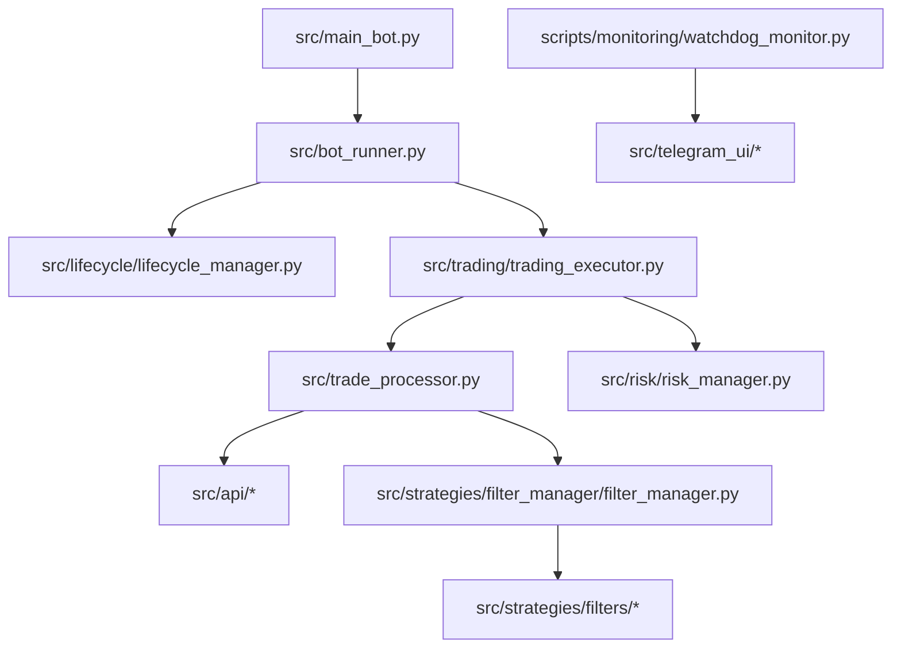

# Carte Technique Etendue (FR)

Mise a jour: 2026-02-28
Runtime cible: depot prive `BinaceBot`

## 1. Architecture generale

## 2. Controle runtime

- `src/main_bot.py`: CLI + chargement config + lockfile + demarrage runner.
- `src/bot_runner.py`: orchestration des iterations et maintenance periodique.
- `src/lifecycle/lifecycle_manager.py`: startup/shutdown.

## 3. Pipeline trading

Orchestrateur: `src/trading/trading_executor.py`.

Sequence:

1. Market fetch.
2. Repricing positions.
3. Passage SELL.
4. Refresh balance optionnel.
5. Passage BUY.
6. Persistance.
7. Decision summary + KPI.

Invariant: **SELL avant BUY**.

## 4. Strategie et execution

- `src/trade_processor.py`: signaux d'entree/sortie, TP/SL.
- `src/strategies/filter_manager/filter_manager.py`.
- Filtres: `RSI`, `SMA`, `ATR`, `Volume`.
- `src/api/*`: marche, filtres exchange, execution Spot/Convert.

## 5. Couche risque

- `src/risk/risk_manager.py`.
- Modes: `off`, `shadow`, `enforce`.
- Limites: positions ouvertes, exposition totale, near-SL, groupes.

## 6. Feature flags

- `freeze_dynamic_tp_sl`
- `strict_min_notional_enforcement`
- `use_closed_candles_for_signals`
- `intelligent_illiquid_unlocking`

Certaines parties restent en mode preview/compatibilite.

## 7. Contrats de donnees

- `data/{mainnet|testnet}/positions.json`
- `data/{mainnet|testnet}/illiquid_positions.json`
- `data/{mainnet|testnet}/heartbeat.json`
- `data/{mainnet|testnet}/runtime_status.json`
- `data/metrics/{mainnet|testnet}/*`

## 8. Plan de controle Telegram

- Watchdog: `scripts/monitoring/watchdog_monitor.py`
- Commandes: `src/telegram_ui/*`

Processus:
- `/start_bot`, `/stop_bot`, `/restart_bot`, `/check_bot`, `/reload_config`

Monitoring:
- `/status`, `/positions`, `/balance`, `/health`, `/performance`, `/report`, `/illiquid`

## 9. Surface de tests

Inventaire observe:

- Modules de test: `120`
- Modules property tests: `31`
