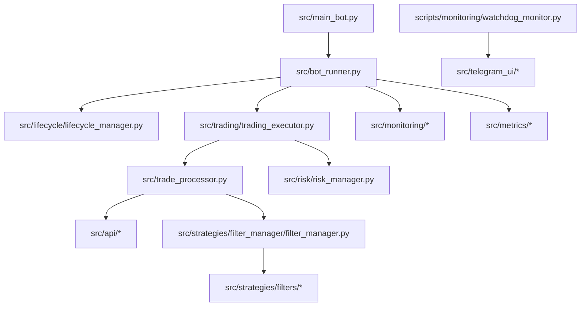

# Розширена Мапа Проєкту (UA)

Оновлено: 2026-02-28
Цільовий рантайм: приватний `BinaceBot`

## 1. Високорівнева архітектура

## 2. Контур запуску

- `src/main_bot.py`: CLI, завантаження конфігів, lockfile, старт `BotRunner`.
- `src/bot_runner.py`: координація циклу + періодичне обслуговування.
- `src/lifecycle/lifecycle_manager.py`: startup/shutdown і runtime status.

## 3. Торговий пайплайн

Оркестратор: `src/trading/trading_executor.py`.

Ітерація:

1. Market fetch.
2. Repricing позицій.
3. SELL-прохід.
4. Refresh балансів (за потреби).
5. BUY-прохід.
6. Збереження стану.
7. Decision summary + KPI.

Ключовий інваріант: **SELL перед BUY**.

## 4. Логіка стратегії

- `src/trade_processor.py`: entry/exit, TP/SL, сигнали.
- `src/strategies/filter_manager/filter_manager.py`: композиція фільтрів.
- `src/strategies/filters/*`: `RSI`, `SMA`, `ATR`, `Volume`.
- `src/api/*`: market data, exchange filters, Spot/Convert execution.

## 5. Ризик-менеджмент

- `src/risk/risk_manager.py`.
- Режими: `off`, `shadow`, `enforce`.
- Підтримка лімітів: кількість позицій, експозиція, near-SL, групові обмеження.

Джерело налаштувань: `config/config.json -> risk_manager`.

## 6. Feature Flags

Прапори rollout:

- `freeze_dynamic_tp_sl`
- `strict_min_notional_enforcement`
- `use_closed_candles_for_signals`
- `intelligent_illiquid_unlocking`

Нотатка: частина шляхів працює в preview/compatibility режимі.

## 7. Дані та контракти збереження

- `data/{mainnet|testnet}/positions.json`
- `data/{mainnet|testnet}/illiquid_positions.json`
- `data/{mainnet|testnet}/heartbeat.json`
- `data/{mainnet|testnet}/runtime_status.json`
- `data/metrics/{mainnet|testnet}/*`

## 8. Telegram і watchdog

- `scripts/monitoring/watchdog_monitor.py`
- `scripts/monitoring/telegram_commands.py`
- `src/telegram_ui/*`

Процес-команди:
- `/start_bot`, `/stop_bot`, `/restart_bot`, `/check_bot`, `/reload_config`

Моніторинг:
- `/status`, `/positions`, `/balance`, `/health`, `/performance`, `/report`, `/illiquid`

## 9. Тестовий контур

Поточний інвентар тестів у приватному репозиторії:

- Модулі тестів: `120`
- Модулі property tests: `31`
