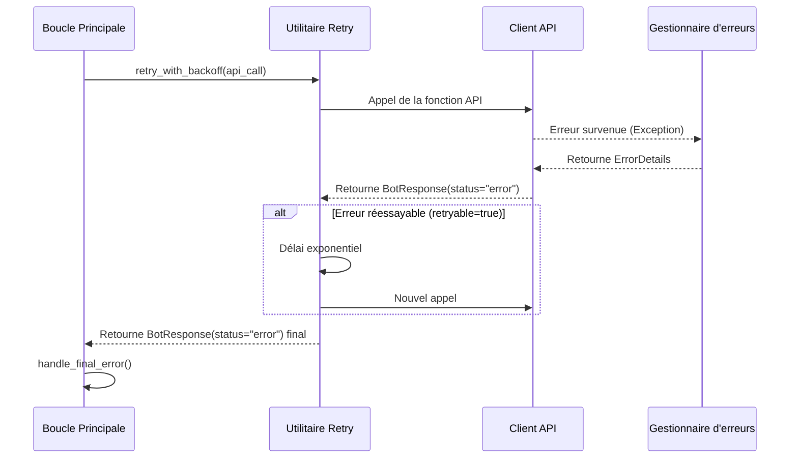

# 🤖 Bot de Trading Automatisé pour Binance

Ce projet est un bot de trading multifonctionnel pour l'échange **Binance**, développé en Python. Le bot présente une architecture modulaire et est conçu pour automatiser les stratégies de trading, la gestion de portefeuille et la surveillance du marché. Il prend en charge à la fois le trading réel (**Mainnet**) et les tests sécurisés sur le **Binance Testnet**.

## 🚀 Fonctionnalités Clés

- 📈 **Gestion Complète des Transactions:** Prise en charge du **Take Profit**, **Stop Loss** et **Hard Stop Loss**.
    
- 📊 **Analyse Technique (AT):** Confirmation des signaux via le **RSI** et les **Moyennes Mobiles**.
    
- ⚖️ **Rééquilibrage et Achat:** Achat automatique d'actifs basé sur la stratégie "**RSI Oversold**".
    
- 🔄 **Prise en Charge des API:** Utilisation flexible de l'**API Spot** pour le trading classique et de l'**API Convert** pour les transactions sans frais.
    
- 🌐 **Prise en Charge du Testnet:** Fonctionnement complet dans l'environnement de test de Binance.
    
- 🔔 **Notifications Telegram:** Messages instantanés pour tous les événements clés.
    
- ⚙️ **Configuration Flexible:** Paramètres ajustables via des fichiers **JSON** sans redémarrage du bot.
    
- 🗂️ **Architecture Modulaire:** Séparation claire du code en services logiques.
    
- ✍️ **Journalisation Détaillée:** Séparation des journaux en logs système, logs de trading et rapports de performance.
    
- 🔒 **Sécurité de Type pour les Opérations Financières:** Garantie de la précision des calculs grâce à l'utilisation du type `Decimal`.
    
- 🛡️ **Gestion Complète des Erreurs:** Système à trois niveaux avec **retry automatique**, **Circuit Breaker** et surveillance de la qualité.
    

## 📄 Guide du Développeur

Ce projet adhère à des normes de développement strictes pour garantir la fiabilité et la précision des opérations financières.
- **[Règles de Développement (Sécurité de Type, Decimal, Tests)]**
## 🗂️ Structure du Projet


```yaml
BinanceBot/
├── config/
│   ├── api_keys.json.example       # Exemple de fichier pour les clés API
│   ├── config.json                 # Fichier de configuration principal
│   └── error_code_reference.json   # Mappage des codes d'erreur
├── data/
│   ├── testnet/
│   │   ├── positions.json          # Positions actuelles
│   │   ├── illiquid_positions.json # Actifs illiquides (blacklist)
│   │   └── exchange_info_cache.json
│   └── mainnet/
├── logs/
│   ├── testnet/
│   │   ├── activity.log            # Événements système
│   │   ├── trades.log              # Opérations de trading
│   │   └── performance.log         # Rapports de performance
│   └── mainnet/
├── src/
│   ├── binance_api_client.py       # Interaction avec l'API Binance
│   ├── circuit_breaker.py          # Circuit Breaker pour les symboles
│   ├── config_loader.py            # Chargement de la configuration
│   ├── data_manager.py             # Gestion des données
│   ├── error_constants.py          # Constantes d'erreur
│   ├── error_handler.py            # Gestionnaire centralisé des erreurs
│   ├── illiquid_manager.py         # API de gestion des actifs illiquides
│   ├── main_bot.py                 # Point d'entrée, logique principale
│   ├── strategies/                 # Répertoire des stratégies
│   ├── ta_calculator.py            # Calcul des indicateurs techniques
│   ├── telegram_notifier.py        # Notifications Telegram
│   └── utils/
│       ├── retry.py                # Utilitaire de tentatives répétées (retry)
│       └── sanitizer.py            # Assainissement des données sensibles
├── tools/
│   ├── validate_error_map.py       # Validateur de la configuration des erreurs
│   └── illiquid_position_manager.py # CLI pour la gestion de la blacklist
├── tests/
│   ├── test_circuit_breaker.py     # Tests Circuit Breaker
│   ├── test_error_handler.py       # Tests du gestionnaire d'erreurs
│   ├── test_error_mapping.py       # Tests de classification
│   ├── test_integration.py         # Tests d'intégration
│   ├── test_metrics.py             # Tests des métriques de qualité
│   ├── test_retry.py               # Tests du mécanisme de retry
│   ├── test_sanitizer.py           # Tests d'assainissement
│   └── test_throttling.py          # Tests du Telegram throttling
├── README.md
├── requirements.txt
├── requirements-dev.txt
└── start_bot.sh
```

## 🛠️ Installation et Configuration

**Étape 1: Clonage du dépôt**

```bash
git clone <URL_DE_VOTRE_DEPOT>
cd BinanceBot
```

**Étape 2: Installation des dépendances**

Assurez-vous que les fichiers sont créés dans le répertoire racine :

```bash
pip install -r requirements.txt
pip install -r requirements-dev.txt  # Pour le développement et les tests
```

**Étape 3: Configuration des clés API**

Créez des clés API sur Binance avec les autorisations `Enable Reading` et `Enable Spot & Margin Trading`. **NE PAS** activer `Enable Withdrawals`. Copiez `config/api_keys.json.example` vers `config/api_keys.json` et remplissez avec vos clés.

**Étape 4: Configuration du bot**

Modifiez `config/config.json` et `config/strategy.json` pour configurer les paramètres du bot.

## ▶️ Démarrage du Bot

- Pour Mainnet :
    

`bash ./start_bot.sh`

- Pour Testnet :
    

`bash ./start_bot.sh --testnet`

---

## ⚠️ Gestion des Erreurs

Le bot met en œuvre un système complet de gestion des erreurs à **trois niveaux** pour assurer une fiabilité et une résilience maximales.

### 1. Architecture

- Niveau Client API (src/binance_api_client.py):
    Intercepte toute exception de l'API et la transmet au niveau suivant.
- Niveau Gestionnaire (src/error_handler.py):
    
    Analyse l'exception, la classe par catégorie (RATE_LIMIT, TRADE_LOGIC_ERROR, etc.) et retourne un objet ErrorDetails standardisé.
    
- Niveau Réponse (main_bot.py):
    Prend la décision finale basée sur la catégorie d'erreur : effectuer une nouvelle tentative (retry), marquer l'actif comme illiquide, ou arrêter le bot de manière critique.
    

### 2. Cycle de Vie d'une Erreur



### 3. Circuit Breaker (Prévention des Pannes Cycliques)

**Objectif:** Bloque automatiquement les symboles qui génèrent des erreurs répétées pour prévenir les tentatives de trading infructueuses continues.

**Paramètres:**
- `FAILURE_THRESHOLD = 3` - nombre d'erreurs avant blocage
- `COOLDOWN_PERIOD = 300` secondes (5 minutes) - durée du blocage
- `WINDOW_SIZE = 300` secondes - fenêtre de temps de comptage des erreurs
**Exemple:**

```
Symbole BTCUSDT → 3 erreurs LOT_SIZE en 5 minutes
→ Circuit Breaker DÉCLENCHÉ (TRIPPED)
→ Symbole ignoré pendant les 5 minutes suivantes
→ Déverrouillage automatique après le cooldown
```

---

## 🚫 Gestion des Positions Illiquides

Le système de gestion des actifs illiquides se compose de deux composants :

### 1. API (`src/illiquid_manager.py`)

Interface programmatique pour la gestion automatique :

```python
from src.illiquid_manager import (
    add_illiquid_position,
    remove_illiquid_position,
    is_illiquid,
    get_illiquid_positions
)

# Ajouter un symbole à la blacklist
add_illiquid_position("BTCUSDT", "Circuit Breaker: 3 trade logic errors")

# Vérifier si dans la blacklist
if is_illiquid("BTCUSDT"):
    print("Symbole bloqué")

# Retirer de la blacklist
remove_illiquid_position("BTCUSDT")

# Obtenir tous les symboles bloqués
positions = get_illiquid_positions()
```

### 2. CLI (`tools/illiquid_position_manager.py`)

Outil en ligne de commande pour la gestion manuelle :

```bash
# Afficher toutes les positions illiquides
python tools/illiquid_position_manager.py --list

# Ajouter un symbole à la blacklist
python tools/illiquid_position_manager.py --add BTCUSDT --reason "Blocage manuel"

# Retirer un symbole
python tools/illiquid_position_manager.py --remove BTCUSDT

# Vider toute la liste
python tools/illiquid_position_manager.py --clear
```

**Intégration avec le Circuit Breaker:**

Lorsqu'un Circuit Breaker se déclenche (trip), le symbole est automatiquement ajouté à `illiquid_positions.json` et ignoré dans la boucle principale :

```
Circuit Breaker DÉCLENCHÉ (BTCUSDT)
→ add_illiquid_position("BTCUSDT", "CB: 3 errors")
→ La boucle principale vérifie is_illiquid()
→ Le symbole est ignoré jusqu'à sa suppression manuelle
```

---

## 📊 Surveillance de la Qualité (4 Métriques SLA)

Le système suit 4 métriques de qualité clés conformément à la Stratégie v10 :

### 1. **Taux de Succès des Retries** (Objectif : >70%)

**Formule:** $\frac{\text{(Retries réussis)}}{\text{(Total des retries)}} \times 100\%$

**Indique:** Combien d'erreurs ont été résolues grâce au mécanisme de tentatives répétées.
**Exemple:**

```
10 erreurs avec retry → 7 résolues avec succès = 70% ✅
```

**Comment améliorer si <70%:**
- Vérifiez la stabilité de la connexion à l'API Binance
- Vérifiez le paramètre `MAX_RETRIES` (doit être 5)
- Analysez les logs pour les erreurs non-retryable

---

### 2. **Taux de Déclenchement du Circuit Breaker (Trip Rate)** (Objectif : <5%)

**Formule:** $\frac{\text{(Nombre de CB trips)}}{\text{(Total des opérations de trading)}} \times 100\%$

**Indique:** La fréquence à laquelle le Circuit Breaker bloque les symboles en raison d'erreurs répétées.
**Exemple:**

```
100 opérations de trading → 2 CB trips = 2% ✅
```

**Comment améliorer si >5%:**
- Vérifiez la qualité des signaux de trading
- Révisez les paramètres des filtres (LOT_SIZE, MIN_NOTIONAL)
- Vérifiez la blacklist illiquide pour les entrées obsolètes
- Envisagez d'augmenter le `FAILURE_THRESHOLD`

---

### 3. **Taux de Classification de Secours (Fallback Classification Rate)** (Objectif : <20%)

**Formule:** $\frac{\text{(Erreurs avec via\_fallback=True)}}{\text{(Total des erreurs)}} \times 100\%$

**Indique:** Le pourcentage d'erreurs qui n'ont pas été trouvées dans `error_code_reference.json` et qui ont été classées via le mécanisme de secours (**fallback**).
**Exemple:**

```
100 erreurs → 15 via fallback = 15% ✅
```

**Comment améliorer si >20%:**
- Recherchez dans les logs les messages avec `via_fallback=True`
- Ajoutez les nouveaux codes d'erreur à `config/error_code_reference.json`
- Élargissez la **Regex Map** pour les messages typiques

---

### 4. **Arrêts Critiques (Critical Stops)** (Objectif : 0)
**Formule:** Compte des événements `CriticalBotStopError`

**Indique:** Le nombre d'arrêts critiques du bot dus à une erreur `AUTH_ERROR_CRITICAL`.

**Exemple:**

```
0 arrêts critiques par semaine = ✅ OBJECTIF ATTEINT
```

**Si >0:**
- Vérifiez **IMMÉDIATEMENT** les logs pour `🛑 Arrêt du bot`
- Vérifiez la validité des clés API
- Vérifiez la liste blanche (IP whitelist) sur Binance
- Vérifiez les droits d'accès des clés API

---

### Comment Calculer les Métriques

**Calcul Automatique:**

```bash
# Calcul des 4 métriques à partir des logs
python tools/calculate_metrics.py

# Exemple de sortie :
# ✅ Taux de Succès des Retries : 72% (>70%)
# ✅ Taux de CB Trip : 3% (<5%)
# ⚠️ Taux de Fallback : 23% (>20% - attention requise !)
# ✅ Arrêts Critiques : 0
```

**Fréquence de Vérification:**
- **Hebdomadaire:** Pour surveiller les tendances
- **En cas d'anomalies:** Immédiatement en cas de comportement inhabituel
- **Après des changements:** Toujours après une mise à jour de la configuration

---

## 🧪 Tests

Le projet dispose d'un système de tests complet avec une couverture >70%.

### Lancement des Tests

```bash
# Lancement de tous les tests
./run_tests.sh

# Lancement avec rapport de couverture (coverage)
pytest --cov=src --cov-report=term-missing

# Lancement d'un fichier de test spécifique
pytest tests/test_error_handler.py -v

# Lancement avec sortie détaillée
pytest tests/ -v --tb=short
```

### Structure des Tests

```
tests/
├── test_circuit_breaker.py      # Circuit Breaker (17 tests)
├── test_error_handler.py        # ErrorHandler (27 tests)
├── test_error_mapping.py        # Classification des erreurs (10 tests)
├── test_integration.py          # Flux de bout en bout (8 tests)
├── test_metrics.py              # Métriques SLA (18 tests)
├── test_retry.py                # Moteur Retry (19 tests)
├── test_sanitizer.py            # Assainissement des données (22 tests)
├── test_throttling.py           # Telegram throttling (9 tests)
└── test_type_safety.py          # Sécurité de type (3 tests)
```

**Total:** 130+ tests, couverture >70%
### Couverture du Code (Coverage)
**Valeurs Cibles:**

- `error_handler.py`: $\ge 80\%$
- `retry.py`: $\ge 80\%$
- `circuit_breaker.py`: $\ge 70\%$
- `illiquid_manager.py`: $\ge 70\%$

**Génération du Rapport HTML:**


```bash
pytest --cov=src --cov-report=html
# Ouvrez htmlcov/index.html dans votre navigateur
```

### Exigences d'Environnement

- **Python:** 3.8+
- **Dépendances:** `requirements-dev.txt`

```bash
pip install -r requirements-dev.txt
```

**Dépendances Principales pour les Tests:**
- `pytest` - framework de test
- `pytest-cov` - rapports de couverture
- `pytest-snapshot` - tests de snapshot
- `freezegun` - mock du temps

### Mise à Jour des Snapshots

Si vous avez délibérément modifié la logique qui affecte le résultat de `ErrorDetails`:

```bash
pytest --snapshot-update
```

---

## 📜 Journalisation (Logging)

Le bot enregistre les événements dans trois fichiers distincts dans les dossiers `logs/mainnet/` ou `logs/testnet/` :

- `activity.log` — informations générales et événements système.
    
- `trades.log` — événements exclusivement liés au trading.
- `performance.log` — rapports quotidiens de performance.
    

**Format des Logs:**

```
2025-11-24 10:30:45 - app - ERROR - [correlation_id: abc-123] [spot_api] TRADE_LOGIC_ERROR: LOT_SIZE filter failure
```

**Éléments:**

- Timestamp (UTC)
- Nom du Logger
- Niveau de Log
- ID de Corrélation (pour le traçage)
- Origine (source de l'erreur)
- Catégorie (catégorie)
- Message (assaini)

---

## ❓ FAQ (Questions Fréquentes)

### Questions Générales sur les Erreurs

Q: Que signifie via_fallback=True dans les logs ?
R: Cela signifie que l'erreur a été identifiée par son message textuel plutôt que par son code unique. C'est un signal pour le développeur d'ajouter ce code d'erreur à config/error_code_reference.json pour un traitement plus précis à l'avenir.

Q: Que faire si une erreur UNKNOWN_CLIENT_ERROR apparaît dans les logs ?
R: C'est une erreur inconnue du système provenant de Binance. Vous devez trouver ce code dans la documentation officielle de Binance, déterminer sa catégorie et l'ajouter à config/error_code_reference.json. Ensuite, exécutez le validateur tools/validate_error_map.py.

Q: Comment ajouter un nouveau code d'erreur ?
R:
1. Ouvrez `config/error_code_reference.json`.
2. Trouvez la section appropriée (`spot_api` ou `convert_api`).
3. Ajoutez une nouvelle entrée `"code_d_erreur": "nom_de_la_categorie"`.
4. Exécutez le validateur :
```bash
python tools/validate_error_map.py
```

### Questions sur les Métriques

Q: Que signifie "Taux de Succès des Retries : 65%" ?
R: Cela signifie que 65% des erreurs ont été résolues avec succès grâce au mécanisme de tentatives répétées. L'objectif est >70%. Si votre taux est inférieur, vérifiez la stabilité de la connexion et les paramètres de retry.

Q: Que signifie "Taux de Circuit Breaker Trip : 8%" ?
R: Cela signifie que le Circuit Breaker s'est déclenché dans 8% des cas par rapport au nombre total d'opérations de trading. L'objectif est <5%. S'il est supérieur, vérifiez la qualité des signaux de trading et les paramètres des filtres.

Q: Que signifie "Taux de Fallback : 25%" ?
R: Cela signifie que 25% des erreurs n'ont pas été trouvées dans error_code_reference.json. L'objectif est <20%. Ajoutez de nouveaux codes d'erreur à la configuration.

Q: Que signifie "Arrêts Critiques : 1" ?
R: Cela signifie que le bot s'est arrêté 1 fois en raison d'une erreur critique (AUTH_ERROR_CRITICAL). L'objectif est = 0. Vérifiez IMMÉDIATEMENT la validité des clés API.
### Questions Opérationnelles

Q: À quelle fréquence faut-il vérifier les métriques ?
R:
- **Hebdomadaire:** Lancez `python tools/calculate_metrics.py`
- **En cas d'anomalies:** Vérifiez immédiatement si vous remarquez un comportement inhabituel
- **Après des changements:** Toujours après une mise à jour de la configuration ou du code

Q: Comment débloquer un symbole après un Circuit Breaker trip ?
R:
1. Vérifiez pourquoi le symbole a "trippé" (consultez les logs)
2. Si le problème est résolu, attendez 5 minutes (le cooldown se réinitialise automatiquement)
3. Si le symbole a été ajouté à la blacklist illiquide: `python tools/illiquid_position_manager.py --remove SYMBOL`

Q: L'erreur RATE_LIMIT_ERROR n'est pas envoyée sur Telegram - est-ce un bug ?
R: Non, cela est conforme à la Stratégie v10. RATE_LIMIT_ERROR est une erreur GLOBALE de l'API (non liée au symbole), par conséquent :
- Elle n'est **PAS** enregistrée dans le Circuit Breaker
- Elle n'est **PAS** envoyée sur Telegram (problème temporaire résolu par le retry)
- Elle est uniquement enregistrée comme **WARNING**

Q: Pourquoi le timestamp N'EST PAS assaini dans les logs ?
R: Conformément à la Stratégie v10, le timestamp n'est pas une donnée sensible. Le masquer compliquerait le diagnostic de l'erreur -1021 (Timestamp out of the recvWindow), qui nécessite une heure précise pour le débogage.

### Questions Techniques

Q: Pourquoi MAX_BACKOFF = 60 secondes et non plus ?
R: Pour un bot de trading, un délai de plus d'une minute est critique :
- Les prix changent rapidement
- Les opportunités de trading sont perdues
- 60 secondes est un équilibre entre la charge sur l'API et la réactivité

Q: Comment fonctionne le système à deux composants du illiquid manager ?
R:
- **API** (`src/illiquid_manager.py`): Interface programmatique pour le Circuit Breaker et la boucle principale
- **CLI** (`tools/illiquid_position_manager.py`): Gestion manuelle par l'opérateur
- Les deux utilisent le fichier partagé `data/testnet/illiquid_positions.json`
- Les opérations **thread-safe** assurent la sécurité en cas d'accès concurrent

---

## 📞 Contacts et Support

Si vous avez des questions ou si vous trouvez un bug, veuillez créer une **Issue** dans le dépôt GitHub.

## ⚠️ Clause de Non-responsabilité

Le trading de crypto-monnaies comporte des risques élevés. Ce bot est un outil d'automatisation et ne garantit pas de profit. Toutes les décisions et les risques liés à son utilisation vous incombent. **Testez toujours les stratégies sur Testnet** avant de les exécuter sur un compte réel.