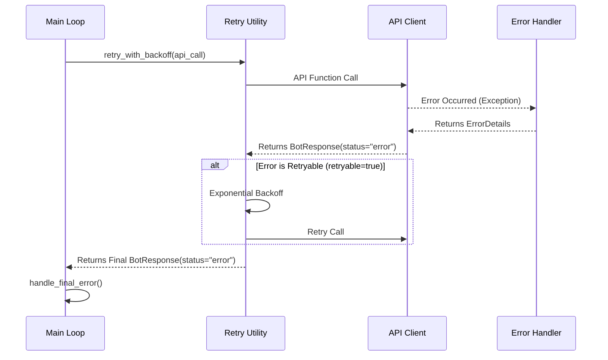

# 🤖 Automated Trading Bot for Binance

This project is a multifunctional trading bot for the Binance exchange, developed in Python. The bot features a modular architecture and is designed for automating trading strategies, portfolio management, and market monitoring. It supports both live trading (Mainnet) and safe testing on Binance Testnet.

## 🚀 Key Features

- 📈 **Comprehensive Trade Management:** Take Profit, Stop Loss, and Hard Stop Loss.
    
- 📊 **Technical Analysis (TA):** Signal confirmation using RSI and Moving Averages.
    
- ⚖️ **Rebalancing and Buying:** Automatic asset purchases based on the "RSI Oversold" strategy.
    
- 🔄 **API Support:** Flexible use of Spot API for classic trading and Convert API for commission-free trades.
    
- 🌐 **Testnet Support:** Full functionality with the Binance test environment.
    
- 🔔 **Telegram Notifications:** Instant alerts for all key events.
    
- ⚙️ **Flexible Configuration:** Settings via JSON files without restarting the bot.
    
- 🗂️ **Modular Architecture:** Clear separation of code into logical services.
    
- ✍️ **Detailed Logging:** Separation of logs into system, trading, and performance reports.
    
- 🔒 **Type Safety for Financial Operations:** Ensuring calculation accuracy using the `Decimal` type.
    
- 🛡️ **Comprehensive Error Handling:** Three-tier system with automatic retry, Circuit Breaker, and quality monitoring.


## 📄 Developer Guidelines

This project adheres to strict development standards to ensure reliability and accuracy in financial operations.

- **[Development Rules (Type Safety, Decimal, Tests)](/docs/DEVELOPMENT_GUIDELINES.md)**

## 🗂️ Project Structure

```yaml
BinanceBot/
├── config/
│   ├── api_keys.json.example       # Example file for API keys
│   ├── config.json                 # Main configuration file
│   └── error_code_reference.json   # Error code map
├── data/
│   ├── testnet/
│   │   ├── positions.json          # Current positions
│   │   ├── illiquid_positions.json  # Illiquid assets (blacklist)
│   │   └── exchange_info_cache.json
│   └── mainnet/
├── logs/
│   ├── testnet/
│   │   ├── activity.log            # System events
│   │   ├── trades.log              # Trading operations
│   │   └── performance.log         # Performance reports
│   └── mainnet/
├── src/
│   ├── binance_api_client.py       # Interaction with Binance API
│   ├── circuit_breaker.py          # Circuit Breaker for symbols
│   ├── config_loader.py            # Configuration loading
│   ├── data_manager.py             # Data management
│   ├── error_constants.py          # Error constants
│   ├── error_handler.py            # Central error handler
│   ├── illiquid_manager.py         # API for managing illiquid assets
│   ├── main_bot.py                 # Entry point, main logic
│   ├── strategies/                 # Directory with strategies
│   ├── ta_calculator.py            # Indicator calculations
│   ├── telegram_notifier.py        # Telegram notifications
│   └── utils/
│       ├── retry.py                # Retry utility
│       └── sanitizer.py            # Sanitization of sensitive data
├── tools/
│   ├── validate_error_map.py       # Validator for error configuration
│   └── illiquid_position_manager.py # CLI for managing blacklist
├── tests/
│   ├── test_circuit_breaker.py     # Circuit Breaker tests
│   ├── test_error_handler.py       # Error handling tests
│   ├── test_error_mapping.py       # Classification tests
│   ├── test_integration.py         # Integration tests
│   ├── test_metrics.py             # SLA metrics tests
│   ├── test_retry.py               # Retry mechanism tests
│   ├── test_sanitizer.py           # Sanitization tests
│   └── test_throttling.py          # Telegram throttling tests
├── README.md
├── requirements.txt
├── requirements-dev.txt
└── start_bot.sh
```

## 🛠️ Setup and Installation

**Step 1: Clone the Repository**

```bash
git clone <YOUR_REPOSITORY_URL>
cd BinanceBot
```

**Step 2: Install Dependencies**

Ensure the following files are present in the root directory:

```bash
pip install -r requirements.txt
pip install -r requirements-dev.txt  # For development and testing
```

**Step 3: Configure API Keys**

Create API keys in Binance with permissions for `Enable Reading` and `Enable Spot & Margin Trading`. **DO NOT** enable `Enable Withdrawals`. Copy `config/api_keys.json.example` to `config/api_keys.json` and fill in your keys.

**Step 4: Configure the Bot**

Edit `config/config.json` and `config/strategy.json` to set up the bot parameters.

## ▶️ Running the Bot

- For Mainnet:

`bash ./start_bot.sh`
    
- For Testnet:

`bash ./start_bot.sh --testnet`
    
---

## ⚠️ Error Handling

The bot implements a comprehensive three-tier error handling system to ensure maximum reliability and resilience.

### 1. Architecture

- **API Client Level (`src/binance_api_client.py`):**
    Catches any exceptions from the API and forwards them to the next level.
    
- **Handler Level (`src/error_handler.py`):**
    Analyzes the exception, classifies it by category (RATE_LIMIT, TRADE_LOGIC_ERROR, etc.), and returns a standardized `ErrorDetails` object.
    
- **Response Level (`main_bot.py`):**
    Makes the final decision based on the error category: retry, mark the asset as illiquid, or critically stop the bot.

### 2. Error Lifecycle



### 3. Circuit Breaker (Preventing Cyclic Failures)

**Purpose:** Automatically blocks symbols that generate repeated errors to prevent continuous failed trading attempts.

**Parameters:**
- `FAILURE_THRESHOLD = 3` — Number of errors before blocking
- `COOLDOWN_PERIOD = 300` seconds (5 minutes) — Blocking time
- `WINDOW_SIZE = 300` seconds — Time window for counting errors

**Example:**
```
Symbol BTCUSDT → 3 LOT_SIZE errors in 5 minutes
→ Circuit Breaker TRIPPED
→ Symbol is skipped for the next 5 minutes
→ Automatically unblocked after cooldown
```

---

## 🚫 Managing Illiquid Positions

The system for managing illiquid assets consists of two components:

### 1. API (`src/illiquid_manager.py`)

Programmatic interface for automatic management:

```python
from src.illiquid_manager import (
    add_illiquid_position,
    remove_illiquid_position,
    is_illiquid,
    get_illiquid_positions
)

# Add a symbol to the blacklist
add_illiquid_position("BTCUSDT", "Circuit Breaker: 3 trade logic errors")

# Check if a symbol is in the blacklist
if is_illiquid("BTCUSDT"):
    print("Symbol is blocked")

# Remove from the blacklist
remove_illiquid_position("BTCUSDT")

# Get all blocked symbols
positions = get_illiquid_positions()
```

### 2. CLI (`tools/illiquid_position_manager.py`)

Command-line tool for manual management:

```bash
# View all illiquid positions
python tools/illiquid_position_manager.py --list

# Add a symbol to the blacklist
python tools/illiquid_position_manager.py --add BTCUSDT --reason "Manual block"

# Remove a symbol
python tools/illiquid_position_manager.py --remove BTCUSDT

# Clear the entire list
python tools/illiquid_position_manager.py --clear
```

**Integration with Circuit Breaker:**

When the Circuit Breaker trips, the symbol is automatically added to `illiquid_positions.json` and skipped in the main loop:

```
Circuit Breaker TRIPPED (BTCUSDT)
→ add_illiquid_position("BTCUSDT", "CB: 3 errors")
→ Main loop checks is_illiquid()
→ Symbol is skipped until manual removal
```

---

## 📊 Quality Monitoring (4 SLA Metrics)

The system tracks 4 key quality metrics according to Strategy v10:

### 1. **Retry Success Rate** (Target: >70%)

**Formula:** `(Successful retries) / (All retries) × 100%`

**What it shows:** The percentage of errors that were successfully recovered through the retry mechanism.

**Example:**
```
10 errors with retry → 7 successfully recovered = 70% ✅
```

**How to improve if <70%:**
- Check the stability of the connection with Binance API
- Check `MAX_RETRIES` settings (should be 5)
- Analyze logs for non-retryable errors

---

### 2. **Circuit Breaker Trip Rate** (Target: <5%)

**Formula:** `(Number of CB trips) / (All trading operations) × 100%`

**What it shows:** How often the Circuit Breaker blocks symbols due to repeated errors.

**Example:**
```
100 trading operations → 2 CB trips = 2% ✅
```

**How to improve if >5%:**
- Check the quality of trading signals
- Review filter settings (LOT_SIZE, MIN_NOTIONAL)
- Check the illiquid blacklist for outdated entries
- Consider increasing `FAILURE_THRESHOLD`
    
---

### 3. **Fallback Classification Rate** (Target: <20%)

**Formula:** `(Errors with via_fallback=True) / (All errors) × 100%`

**What it shows:** The percentage of errors that were not found in `error_code_reference.json` and classified through the fallback mechanism.

**Example:**
```
100 errors → 15 via fallback = 15% ✅
```

**How to improve if >20%:**
- Find messages with `via_fallback=True` in the logs
- Add new error codes to `config/error_code_reference.json`
- Expand the Regex Map for typical messages
    
---

### 4. **Critical Stops** (Target: 0)

**Formula:** Count of `CriticalBotStopError` events

**What it shows:** The number of critical bot stops due to `AUTH_ERROR_CRITICAL`.

**Example:**
```
0 critical stops in a week = ✅ TARGET ACHIEVED
```

**If >0:**
- IMMEDIATELY check logs for `🛑 Bot stopped`
- Check the validity of API keys
- Check IP whitelist on Binance 
- Check API key permissions

---

### How to Calculate Metrics

**Automatic Calculation:**

```bash
# Calculate all 4 metrics from logs
python tools/calculate_metrics.py

# Example output:
# ✅ Retry Success Rate: 72% (>70%)
# ✅ CB Trip Rate: 3% (<5%)
# ⚠️ Fallback Rate: 23% (>20% - needs attention!)
# ✅ Critical Stops: 0
```

**Check Frequency:**
- **Weekly:** For trend monitoring
- **On anomalies:** Immediately if unusual behavior is noticed
- **After changes:** Always after updating configuration or code

---

## 🧪 Testing

The project has a comprehensive testing system with coverage >70%.

### Running Tests

```bash
# Run all tests
./run_tests.sh

# Run with coverage report
pytest --cov=src --cov-report=term-missing

# Run a specific test file
pytest tests/test_error_handler.py -v

# Run with detailed output
pytest tests/ -v --tb=short
```

### Test Structure

```bash
tests/
├── test_circuit_breaker.py      # Circuit Breaker (17 tests)
├── test_error_handler.py        # ErrorHandler (27 tests)
├── test_error_mapping.py        # Error classification (10 tests)
├── test_integration.py          # End-to-end flows (8 tests)
├── test_metrics.py              # SLA metrics (18 tests)
├── test_retry.py                # Retry Engine (19 tests)
├── test_sanitizer.py            # Data sanitization (22 tests)
├── test_throttling.py           # Telegram throttling (9 tests)
└── test_type_safety.py          # Type safety (3 tests)
```

**Total:** 130+ tests, coverage >70%

### Code Coverage (Coverage)

**Target Values:**
- `error_handler.py`: ≥80%
- `retry.py`: ≥80%
- `circuit_breaker.py`: ≥70%
- `illiquid_manager.py`: ≥70%

**Generate HTML Report:**

```bash
pytest --cov=src --cov-report=html
# Open htmlcov/index.html in your browser
```

### Environment Requirements

- **Python:** 3.8+
- **Dependencies:** `requirements-dev.txt`
    
```bash
pip install -r requirements-dev.txt
```

**Main Dependencies for Testing:**
- `pytest` — testing framework
- `pytest-cov` — coverage reports
- `pytest-snapshot` — snapshot tests
- `freezegun` — time mocking

### Updating Snapshots

If you intentionally changed the logic that affects the `ErrorDetails` result:

```bash
pytest --snapshot-update
```

---

## 📜 Logging

The bot logs to three separate files in the `logs/mainnet/` or `logs/testnet/` folders:
- `activity.log` — general information and system events.
- `trades.log` — events related exclusively to trading.
- `performance.log` — daily performance reports.
    
**Log Format:**

```
2025-11-24 10:30:45 - app - ERROR - [correlation_id: abc-123] [spot_api] TRADE_LOGIC_ERROR: LOT_SIZE filter failure
```

**Elements:**
- Timestamp (UTC)
- Logger name
- Log level
- Correlation ID (for tracing)
- Origin (source of the error)
- Category (category)
- Message (sanitized)

---

## ❓ FAQ (Frequently Asked Questions)

### General Error Questions

**Q: What does `via_fallback=True` in logs mean?**
**A:** This means the error was identified by its text message, not by a unique code. This is a signal for the developer to add this error code to `config/error_code_reference.json` for more accurate handling in the future.

**Q: What should I do if the logs show an `UNKNOWN_CLIENT_ERROR`?**
**A:** This is an unknown error from Binance. You need to find this code in the official Binance documentation, determine its category, and add it to `config/error_code_reference.json`. Then run the validator `tools/validate_error_map.py`.

**Q: How do I add a new error code?**
**A:**
1. Open `config/error_code_reference.json`.
2. Find the appropriate section (`spot_api` or `convert_api`).
3. Add a new entry `"error_code": "category_name"`. 
4. Run the validator:

```bash
python tools/validate_error_map.py
```

### Metrics Questions

**Q: What does "Retry Success Rate: 65%" mean?**
**A:** This means that 65% of errors were successfully recovered through the retry mechanism. The target value is >70%. If your value is lower, check the connection stability and retry settings.

**Q: What does "Circuit Breaker Trip Rate: 8%" mean?**
**A:** This means that the Circuit Breaker was triggered in 8% of cases out of the total number of trading operations. The target value is <5%. If higher, check the quality of trading signals and filter settings.

**Q: What does "Fallback Rate: 25%" mean?**
**A:** This means that 25% of errors were not found in `error_code_reference.json`. The target value is <20%. Add new error codes to the configuration.

**Q: What does "Critical Stops: 1" mean?**
**A:** This means that the bot stopped 1 time due to a critical error (`AUTH_ERROR_CRITICAL`). The target value is 0. IMMEDIATELY check the validity of API keys.

### Operational Questions

**Q: How often should I check the metrics?**
**A:**
- **Weekly:** Run `python tools/calculate_metrics.py`
- **On anomalies:** Check immediately if you notice unusual behavior
- **After changes:** Always after updating configuration or code
    
**Q: How to unblock a symbol after a Circuit Breaker trip?**
**A:**
1. Check why the symbol tripped (see logs)
2. If the issue is resolved, wait 5 minutes (cooldown will reset automatically)
3. If the symbol is added to the illiquid blacklist: `python tools/illiquid_position_manager.py --remove SYMBOL`
    
**Q: Why isn't `RATE_LIMIT_ERROR` sent to Telegram? Is this a bug?**
**A:** No, this is according to Strategy v10. `RATE_LIMIT_ERROR` is a GLOBAL API error (not symbol-specific), so:
- It is **NOT** recorded in the Circuit Breaker.
- It is **NOT** sent to Telegram (temporary issue resolved via retry)
- It is only logged as a WARNING
    
**Q: Why isn't the timestamp sanitized in logs?**
**A:** According to Strategy v10, timestamps are not considered sensitive data. Masking them complicates debugging the `-1021` error (Timestamp out of the recvWindow), which requires precise timing for troubleshooting.

### Technical Questions

**Q: Why is `MAX_BACKOFF` set to 60 seconds and not more?**
**A:** For a trading bot, delays over 1 minute are critical:
- Prices change rapidly.
- Trading opportunities are lost.
- 60 seconds is a balance between API load and responsiveness.
    
**Q: How does the two-component illiquid manager system work?**
**A:**
- **API** (`src/illiquid_manager.py`): Programmatic interface for Circuit Breaker and the main loop.
- **CLI** (`tools/illiquid_position_manager.py`): Manual management by the operator.
- Both use the shared file `data/testnet/illiquid_positions.json`.
- Thread-safe operations ensure safety during concurrent access.
    
---

## 📞 Contact and Support

If you have questions or found a bug, please create an Issue in the GitHub repository.

## ⚠️ Disclaimer

Cryptocurrency trading carries high risks. This bot is an automation tool and does not guarantee profit. All decisions and risks associated with its use are yours. Always test strategies on Testnet before running them on a live account.