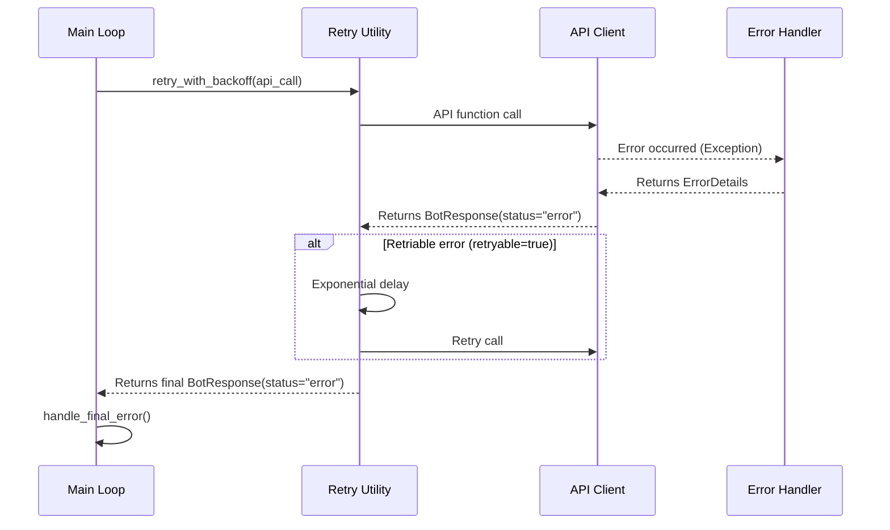

# 🤖 Automated Trading Bot for Binance

This project is a multifunctional trading bot for the Binance exchange, developed in Python. The bot has a modular architecture and is designed for automating trading strategies, portfolio management, and market monitoring. It supports both real trading (Mainnet) and safe testing on Binance Testnet.

## 🚀 Main Features

- 📈 **Comprehensive Trade Management:** Take Profit, Stop Loss, and Hard Stop Loss.

- 📊 **Technical Analysis (TA):** Signal confirmation via RSI and Moving Averages.

- ⚖️ **Rebalancing and Buying:** Automatic asset buying based on "RSI Oversold" strategy.

- 🔄 **API Support:** Flexible use of Spot API for classic trading and Convert API for commission-free trades.

- 🌐 **Testnet Support:** Full operation with Binance test environment.

- 🔔 **Telegram Notifications:** Instant messages about all key events.

- ⚙️ **Flexible Configuration:** Settings through JSON files without bot restart.

- 🗂️ **Modular Architecture:** Clear code separation into logical services.

- ✍️ **Detailed Logging:** Log separation into system, trading, and performance reports.

- 🔒 **Type Safety for Financial Operations:** Guarantee of calculation accuracy through `Decimal` type usage.

- 🛡️ **Comprehensive Error Handling:** Three-level system with automatic retry, Circuit Breaker, and quality monitoring.

## 📄 Developer Guidelines

This project adheres to strict development standards to ensure reliability and accuracy of financial operations.

- [**📂 Detailed project files map**](/docs/PROJECT_MAP_EN.md) - Architecture and module purposes
- [**🧪 Testing and validation guide**](/docs/guides/TESTING_GUIDE_EN.md) - Comprehensive validation after Stage 3 Refactoring
- [**📋 Quick commands**](/docs/guides/QUICK_COMMANDS.md) - Frequently used commands for development

## 🗂️ Project Structure

```yaml
BinanceBot/
├── config/
│   ├── api_keys.json.example       # Example file for API keys
│   ├── config.json                 # Main bot configuration file
│   ├── strategy.json               # Trading strategy configuration
│   └── error_code_reference.json   # Error codes map
├── data/
│   ├── testnet/
│   │   ├── positions.json          # Current positions
│   │   └── illiquid_positions.json # Illiquid assets (blacklist)
│   ├── mainnet/
│   └── metrics/                    # Performance metrics
├── logs/
│   ├── testnet/
│   │   ├── activity.log            # System events
│   │   ├── trades.log              # Trading operations
│   │   └── performance.log         # Performance reports
│   └── mainnet/
├── src/
│   ├── api/                        # API clients and utilities
│   ├── decorators/                 # Decorators for retry and rate limiting
│   ├── lifecycle/                  # Bot lifecycle management
│   ├── metrics/                    # Metrics collection and analysis
│   ├── monitoring/                 # Monitoring and performance tracking
│   ├── strategies/                 # Trading strategies and filters
│   ├── trading/                    # Trade execution
│   ├── utils/                      # Auxiliary utilities
│   │   ├── api_utils.py            # API response processing
│   │   ├── balance_utils.py        # Balance operations
│   │   ├── dynamic_tp_sl.py        # Dynamic TP/SL calculation
│   │   ├── retry.py                # Retry mechanism
│   │   ├── sanitizer.py            # Sensitive data sanitization
│   │   └── trading_utils.py        # Trading helpers
│   ├── binance_api_client.py       # Binance API interaction
│   ├── bot_context.py              # Thread-safe state management
│   ├── bot_runner.py               # Main bot execution loop
│   ├── circuit_breaker.py          # Circuit Breaker for symbols
│   ├── cli_parser.py               # CLI arguments (--testnet, --dry-run)
│   ├── config_loader.py            # Configuration loading
│   ├── constants.py                # System constants
│   ├── data_manager.py             # Data management (positions.json)
│   ├── decision_matrix.py          # Trading decision logic
│   ├── error_constants.py          # Error constants
│   ├── error_handler.py            # Central error handler
│   ├── logging_config.py           # Logging configuration
│   ├── main_bot.py                 # Entry point
│   ├── models.py                   # Data classes with Decimal validation
│   ├── performance_reporter.py     # Performance reports
│   ├── ta_calculator.py            # Technical indicators calculation
│   ├── telegram_bot_commands.py    # Telegram bot commands
│   ├── telegram_notifier.py        # Telegram notifications
│   └── trade_processor.py          # Trade signal processing
├── scripts/
│   ├── backup_data.py              # Data backup
│   ├── clean_testnet_logs.py       # Testnet data cleanup
│   ├── smoke_test_runner.py        # Smoke testing
│   ├── test_logging_integration.py # Logging tests
│   ├── validate_thread_safety.py   # Thread safety check
│   └── verify_data_paths.py        # Access rights check
├── tools/
│   ├── audit/                      # Code audit tools
│   ├── benchmark/                  # Benchmark baseline results
│   ├── integration/                # Integration utilities
│   ├── benchmark.py                # Performance testing
│   ├── detect_cycles.py            # Cyclic dependencies detection
│   ├── mainnet_readiness_analyzer.py # Mainnet readiness analysis
│   └── validate_config.py          # Configuration validation
├── tests/
│   ├── test_*.py                   # 130+ tests (>70% coverage)
│   └── test_*_property.py          # Property-based tests
├── docs/
│   ├── guides/                     # Developer guides
│   │   ├── FILES_GUIDE.md          # Project files description
│   │   ├── QUICK_COMMANDS.md       # Quick commands
│   │   └── TESTING_GUIDE_EN.md     # Testing guide
│   ├── PROJECT_MAP_EN.md           # Technical project map
│   └── *.md                        # Strategy and logic analysis
├── README_EN.md
├── requirements.txt
├── requirements-dev.txt
└── start_bot.sh
```

## 🛠️ Installation and Setup

**Step 1: Repository Cloning**

```bash
git clone <YOUR_REPOSITORY_URL>
cd BinanceBot
```

**Step 2: Dependencies Installation**

Make sure to create files in the root directory:

```bash
pip install -r requirements.txt
pip install -r requirements-dev.txt  # For development and testing
```

**Step 3: API Keys Setup**

Create API keys in Binance with `Enable Reading` and `Enable Spot & Margin Trading` permissions. **DO NOT** enable `Enable Withdrawals`. Copy `config/api_keys.json.example` to `config/api_keys.json` and fill with your keys.

**Step 4: Configuration Setup**

Edit `config/config.json` and `config/strategy.json` to configure bot parameters.

## ▶️ Bot Launch

- For Mainnet:

`bash ./start_bot.sh`

- For Testnet:

`bash ./start_bot.sh --testnet`

---

## ⚠️ Error Handling

The bot implements a comprehensive three-level error handling system to ensure maximum reliability and resilience.

### 1. Architecture

- **API Client Level (`src/binance_api_client.py`):**
  Catches any exceptions from API and passes them to the next level.

- **Handler Level (`src/error_handler.py`):**
  Analyzes the exception, classifies it by category (RATE_LIMIT, TRADE_LOGIC_ERROR, etc.) and returns a standardized `ErrorDetails` object.

- **Response Level (`main_bot.py`):**
  Makes final decision based on error category: perform retry, mark asset as illiquid, or critically stop the bot.

### 2. Error Lifecycle



### 3. Circuit Breaker (Preventing Cyclic Failures)

**Purpose:** Automatically blocks symbols that generate repeated errors to prevent continuous failed trading attempts.

**Parameters:**
- `FAILURE_THRESHOLD = 3` - number of errors before blocking
- `COOLDOWN_PERIOD = 300` seconds (5 minutes) - blocking time
- `WINDOW_SIZE = 300` seconds - time window for error counting

**Example:**
```
Symbol BTCUSDT → 3 LOT_SIZE errors in 5 minutes
→ Circuit Breaker TRIPPED
→ Symbol skipped for next 5 minutes
→ Automatically unblocks after cooldown
```

---

## 🚫 Illiquid Positions Management

Illiquid assets management system is implemented through thread-safe API in BotContext.

### API (`src/bot_context.py`)

Program interface for automatic management:

```python
from src.bot_context import BotContext

# Bot context creation (usually already exists in bot_runner)
context = BotContext(...)

# Add symbol to blacklist
illiquid_data = {
    "reason": "Circuit Breaker: 3 trade logic errors",
    "timestamp": time.time()
}
context.add_illiquid_position("BTCUSDT", illiquid_data)

# Check if in blacklist
if context.is_illiquid("BTCUSDT"):
    print("Symbol blocked")

# Remove from blacklist
context.remove_illiquid_position("BTCUSDT")

# Get all blocked
all_illiquid = context.get_all_illiquid_positions()

# Clean expired entries (older than 24 hours)
cleaned_count = context.cleanup_expired_illiquid(max_age_hours=24)
```

### Helper Functions (`src/utils/trading_utils.py`)

High-level helpers for illiquid position operations:

```python
from src.utils.trading_utils import add_to_illiquid, is_symbol_illiquid

# Add symbol with automatic data formation
add_to_illiquid(symbol="BTCUSDT", reason="Manual block")

# Quick check (without context access)
if is_symbol_illiquid("BTCUSDT"):
    print("Symbol in blacklist")
```

### Circuit Breaker Integration

When Circuit Breaker trips, symbol is automatically added to `illiquid_positions.json` and skipped in main loop:

```
Circuit Breaker TRIPPED (BTCUSDT)
→ context.add_illiquid_position("BTCUSDT", {...})
→ Stored in data/testnet/illiquid_positions.json
→ Main loop checks context.is_illiquid()
→ Symbol skipped until manual removal or auto-cleanup
```

### Manual Management

For manual editing, open `data/testnet/illiquid_positions.json` or `data/mainnet/illiquid_positions.json`:

```json
{
  "BTCUSDT": {
    "reason": "Circuit Breaker: 3 errors",
    "timestamp": 1703001234.567,
    "added_at": "2024-12-19T10:30:45"
  }
}
```

Delete symbol entry and restart bot, or use `cleanup_expired_illiquid()` for automatic cleanup.

---

## 📊 Quality Monitoring (4 SLA Metrics)

System tracks 4 key quality metrics according to Strategy v10:

### 1. **Retry Success Rate** (Target: >70%)

**Formula:** `(Successful retries) / (All retries) × 100%`

**What it shows:** How many errors were recovered through retry mechanism.

**Example:**
```
10 errors with retry → 7 successfully recovered = 70% ✅
```

**How to improve if <70%:**
- Check Binance API connection stability
- Check `MAX_RETRIES` settings (should be 5)
- Analyze logs for non-retryable errors

---

### 2. **Circuit Breaker Trip Rate** (Target: <5%)

**Formula:** `(Number of CB trips) / (All trading operations) × 100%`

**What it shows:** How often Circuit Breaker blocks symbols due to repeated errors.

**Example:**
```
100 trading operations → 2 CB trips = 2% ✅
```

**How to improve if >5%:**
- Check trading signal quality
- Review filter settings (LOT_SIZE, MIN_NOTIONAL)
- Check illiquid blacklist for outdated entries
- Consider increasing `FAILURE_THRESHOLD`

---

### 3. **Fallback Classification Rate** (Target: <20%)

**Formula:** `(Errors with via_fallback=True) / (All errors) × 100%`

**What it shows:** Percentage of errors that were not found in `error_code_reference.json` and classified through fallback mechanism.

**Example:**
```
100 errors → 15 through fallback = 15% ✅
```

**How to improve if >20%:**
- Find logs with `via_fallback=True` messages
- Add new error codes to `config/error_code_reference.json`
- Expand Regex Map for typical messages

---

### 4. **Critical Stops** (Target: 0)

**Formula:** Count of `CriticalBotStopError` events

**What it shows:** Number of critical bot stops due to `AUTH_ERROR_CRITICAL`.

**Example:**
```
0 critical stops per week = ✅ TARGET ACHIEVED
```

**If >0:**
- IMMEDIATELY check logs for `🛑 Bot stop` presence
- Check API keys validity
- Check IP whitelist on Binance
- Check API key access rights

---

### How to Calculate Metrics

**Automatic calculation:**

```bash
# Calculate all 4 metrics from logs
python tools/calculate_metrics.py

# Example output:
# ✅ Retry Success Rate: 72% (>70%)
# ✅ CB Trip Rate: 3% (<5%)
# ⚠️ Fallback Rate: 23% (>20% - needs attention!)
# ✅ Critical Stops: 0
```

**Check frequency:**
- **Weekly:** For trend monitoring
- **On anomalies:** Immediately when unusual behavior noticed
- **After changes:** Always after configuration or code updates

---

## 🧪 Testing

Project has comprehensive testing system with >70% coverage.

### Test Running

```bash
# Run all tests
./run_tests.sh

# Run with coverage report
pytest --cov=src --cov-report=term-missing

# Run specific test file
pytest tests/test_error_handler.py -v

# Run with detailed output
pytest tests/ -v --tb=short
```

### Test Structure

```bash
tests/
├── test_circuit_breaker.py      # Circuit Breaker (17 tests)
├── test_error_handler.py        # ErrorHandler (27 tests)
├── test_error_mapping.py        # Error classification (10 tests)
├── test_integration.py          # End-to-end flows (8 tests)
├── test_metrics.py              # SLA metrics (18 tests)
├── test_retry.py                # Retry Engine (19 tests)
├── test_sanitizer.py            # Data sanitization (22 tests)
├── test_throttling.py           # Telegram throttling (9 tests)
└── test_type_safety.py          # Type safety (3 tests)
```

**Total:** 130+ tests, coverage >70%

### Code Coverage (Coverage)

**Target values:**
- `error_handler.py`: ≥80%
- `retry.py`: ≥80%
- `circuit_breaker.py`: ≥70%
- `bot_context.py`: ≥70%
- `trade_processor.py`: ≥70%

**HTML report generation:**

```bash
pytest --cov=src --cov-report=html
# Open htmlcov/index.html in browser
```

### Environment Requirements

- **Python:** 3.8+ (Recommended: 3.12)
  - ⚠️ **Python 3.13:** `python-telegram-bot 13.15` incompatible with Python 3.13
  - ✅ **Python 3.12:** Full compatibility, recommended for production
  - ✅ **Python 3.8-3.11:** Full compatibility
  - 📖 Details: `docs/PYTHON_3.13_COMPATIBILITY.md`
- **Dependencies:** `requirements-dev.txt`

```bash
pip install -r requirements-dev.txt
```

**Main testing dependencies:**
- `pytest` - test framework
- `pytest-cov` - coverage reports
- `pytest-snapshot` - snapshot tests
- `freezegun` - time mocking

### Snapshot Updates

If you consciously changed logic affecting `ErrorDetails` result:

```bash
pytest --snapshot-update
```

---

## 📜 Logging

Bot maintains logging in three separate files in `logs/mainnet/` or `logs/testnet/` folders:
- `activity.log` — general information and system events.
- `trades.log` — events related exclusively to trading.
- `performance.log` — daily performance reports.

**Log format:**

```
2025-11-24 10:30:45 - app - ERROR - [correlation_id: abc-123] [spot_api] TRADE_LOGIC_ERROR: LOT_SIZE filter failure
```

**Elements:**
- Timestamp (UTC)
- Logger name
- Log level
- Correlation ID (for tracing)
- Origin (error source)
- Category (category)
- Message (sanitized)

---

## ❓ FAQ (Frequently Asked Questions)

### General Error Questions

**Q:** What does `via_fallback=True` in logs mean?  
**A:** This means the error was identified by its text message, not by a unique code. This is a signal for developer to add this error code to `config/error_code_reference.json` for more accurate future handling.

**Q:** What to do if `UNKNOWN_CLIENT_ERROR` appears in logs?  
**A:** This is an unknown error from Binance for the system. Need to find this code in official Binance documentation, determine its category, and add to `config/error_code_reference.json`. After that, run validator `tools/validate_error_map.py`.

**Q:** How to add a new error code?  
**A:**
1. Open `config/error_code_reference.json`.
2. Find the required section (`spot_api` or `convert_api`).
3. Add new entry `"error_code": "category_name"`.
4. Run validator:

```bash
python tools/validate_error_map.py
```

### Metrics Questions

**Q:** What does "Retry Success Rate: 65%" mean?  
**A:** This means 65% of errors were successfully recovered through retry mechanism. Target value >70%. If your rate is lower - check connection stability and retry settings.

**Q:** What does "Circuit Breaker Trip Rate: 8%" mean?  
**A:** This means Circuit Breaker triggered in 8% of cases from total trading operations. Target value <5%. If higher - check trading signal quality and filter settings.

**Q:** What does "Fallback Rate: 25%" mean?  
**A:** This means 25% of errors were not found in `error_code_reference.json`. Target value <20%. Add new error codes to configuration.

**Q:** What does "Critical Stops: 1" mean?  
**A:** This means bot stopped 1 time due to critical error (`AUTH_ERROR_CRITICAL`). Target value = 0. IMMEDIATELY check API key validity.

### Operational Questions

**Q:** How often should metrics be checked?  
**A:**
- **Weekly:** Run `python tools/calculate_metrics.py`
- **On anomalies:** Check immediately if unusual behavior noticed
- **After changes:** Always after configuration or code updates

**Q:** How to unblock symbol after Circuit Breaker trip?  
**A:**
1. Check why symbol tripped (see logs)
2. If problem resolved, wait 5 minutes (cooldown resets automatically)
3. If symbol added to illiquid blacklist: edit `data/testnet/illiquid_positions.json` and delete symbol entry, or use `context.remove_illiquid_position("SYMBOL")` in code

**Q:** RATE_LIMIT_ERROR is not sent to Telegram - is this a bug?  
**A:** No, this complies with Strategy v10. `RATE_LIMIT_ERROR` is a GLOBAL API error (not tied to symbol), so:
- **NOT** recorded in Circuit Breaker
- **NOT** sent to Telegram (temporary issue resolved through retry)
- Only logged as WARNING

**Q:** Why is timestamp NOT sanitized in logs?  
**A:** According to Strategy v10, timestamp is not sensitive data. Its masking complicates `-1021` error diagnosis (Timestamp out of the recvWindow), which requires precise time for debugging.

### Technical Questions

**Q:** Why MAX_BACKOFF = 60 seconds, not more?  
**A:** For trading bot, delay over 1 minute is critical:
- Prices change quickly
- Trading opportunities are lost
- 60 seconds — balance between API load and responsiveness

**Q:** How does illiquid positions management system work?  
**A:**
- **API** (`src/bot_context.py`): Thread-safe interface for Circuit Breaker and all bot components
- **Utilities** (`src/utils/trading_utils.py`): High-level helpers for quick access
- Data stored in `data/testnet/illiquid_positions.json` or `data/mainnet/illiquid_positions.json`
- Thread-safe operations through locks ensure concurrent access safety
- Support for automatic cleanup of expired entries via `cleanup_expired_illiquid()`

---

## 📞 Contacts and Support

If you have questions or found a bug — please create an Issue in the GitHub repository.

## ⚠️ Disclaimer

Cryptocurrency trading carries high risks. This bot is an automation tool and does not guarantee profits. All decisions and risks associated with its use are on you. Always test strategies on Testnet before running on a real account.
