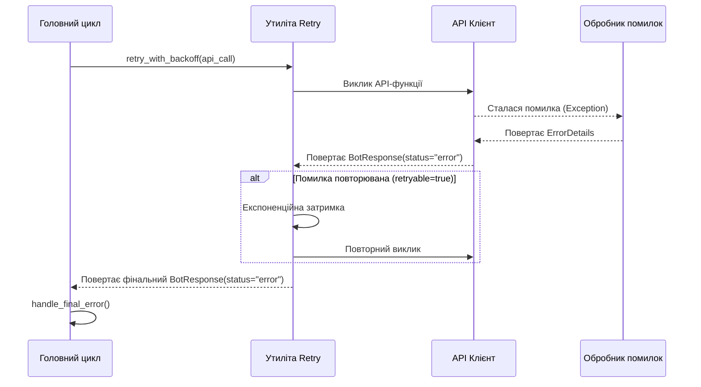

# 🤖 Автоматизований Торговий Бот для Binance

Цей проєкт є багатофункціональним торговим ботом для біржі Binance, розробленим на Python. Бот має модульну архітектуру і призначений для автоматизації торгових стратегій, управління портфелем та моніторингу ринку. Він підтримує як реальну торгівлю (Mainnet), так і безпечне тестування на Binance Testnet.

## 🚀 Основні Можливості

- 📈 **Комплексне Управління Угодами:** Take Profit, Stop Loss та Hard Stop Loss.
    
- 📊 **Технічний Аналіз (TA):** Підтвердження сигналів через RSI та Moving Averages.
    
- ⚖️ **Ребалансування та Купівля:** Автоматична купівля активів на основі стратегії "RSI Oversold".
    
- 🔄 **Підтримка API:** Гнучке використання Spot API для класичної торгівлі та Convert API для угод без комісій.
    
- 🌐 **Підтримка Тестнету:** Повноцінна робота з тестовим середовищем Binance.
    
- 🔔 **Сповіщення в Telegram:** Миттєві повідомлення про всі ключові події.
    
- ⚙️ **Гнучка Конфігурація:** Налаштування через JSON-файли без перезапуску бота.
    
- 🗂️ **Модульна Архітектура:** Чітке розділення коду на логічні сервіси.
    
- ✍️ **Детальне Логування:** Розділення логів на системні, торгові та звіти по ефективності.
    
- 🔒 **Типобезпека фінансових операцій:** Гарантія точності розрахунків завдяки використанню типу `Decimal`.

- 🛡️ **Комплексна обробка помилок:** Трирівнева система з автоматичним retry, Circuit Breaker та моніторингом якості.
    

## 📄 Гайдлайн для розробників

Цей проєкт дотримується строгих стандартів розробки для забезпечення надійності та точності фінансових операцій.

- [**Правила розробки (типобезпека, Decimal, тести)**](/docs/DEVELOPMENT_GUIDELINES.md)

## 🗂️ Структура Проєкту

```yaml
BinanceBot/
├── config/
│   ├── api_keys.json.example       # Приклад файлу для ключів API
│   ├── config.json                 # Основний файл налаштувань
│   └── error_code_reference.json   # Мапа кодів помилок
├── data/
│   ├── testnet/
│   │   ├── positions.json          # Поточні позиції
│   │   ├── illiquid_positions.json # Неліквідні активи (blacklist)
│   │   └── exchange_info_cache.json
│   └── mainnet/
├── logs/
│   ├── testnet/
│   │   ├── activity.log            # Системні події
│   │   ├── trades.log              # Торгові операції
│   │   └── performance.log         # Звіти ефективності
│   └── mainnet/
├── src/
│   ├── binance_api_client.py       # Взаємодія з Binance API
│   ├── circuit_breaker.py          # Circuit Breaker для символів
│   ├── config_loader.py            # Завантаження конфігурації
│   ├── data_manager.py             # Управління даними
│   ├── error_constants.py          # Константи помилок
│   ├── error_handler.py            # Центральний обробник помилок
│   ├── illiquid_manager.py         # API управління неліквідними активами
│   ├── main_bot.py                 # Точка входу, основна логіка
│   ├── strategies/                 # Каталог зі стратегіями
│   ├── ta_calculator.py            # Розрахунок індикаторів
│   ├── telegram_notifier.py        # Сповіщення в Telegram
│   └── utils/
│       ├── retry.py                # Утиліта для повторних спроб
│       └── sanitizer.py            # Санітизація чутливих даних
├── tools/
│   ├── validate_error_map.py       # Валідатор конфігурації помилок
│   └── illiquid_position_manager.py # CLI для управління blacklist
├── tests/
│   ├── test_circuit_breaker.py     # Тести Circuit Breaker
│   ├── test_error_handler.py       # Тести обробки помилок
│   ├── test_error_mapping.py       # Тести класифікації
│   ├── test_integration.py         # Інтеграційні тести
│   ├── test_metrics.py             # Тести метрик якості
│   ├── test_retry.py               # Тести retry механізму
│   ├── test_sanitizer.py           # Тести санітизації
│   └── test_throttling.py          # Тести Telegram throttling
├── README.md
├── requirements.txt
├── requirements-dev.txt
└── start_bot.sh
```

## 🛠️ Встановлення та Налаштування

**Крок 1: Клонування репозиторію**

```bash
git clone <URL_ВАШОГО_РЕПОЗИТОРІЮ>
cd BinanceBot
```

**Крок 2: Встановлення залежностей** 

Переконайтеся що у кореневій директорії створено файли:

```bash
pip install -r requirements.txt
pip install -r requirements-dev.txt  # Для розробки та тестування
```

**Крок 3: Налаштування API ключів** 

Створіть API ключі у Binance з дозволами `Enable Reading` та `Enable Spot & Margin Trading`. **НЕ** вмикайте `Enable Withdrawals`. Скопіюйте `config/api_keys.json.example` у `config/api_keys.json` та заповніть вашими ключами.

**Крок 4: Налаштування конфігурації** 

Відредагуйте `config/config.json` та `config/strategy.json` для налаштування параметрів бота.

## ▶️ Запуск Бота

- Для Mainnet:

`bash ./start_bot.sh`

- Для Testnet: 

`bash ./start_bot.sh --testnet`

---

## ⚠️ Обробка помилок

Бот реалізує комплексну трирівневу систему обробки помилок для забезпечення максимальної надійності та стійкості.

### 1. Архітектура

- **Рівень API-клієнта (`src/binance_api_client.py`):**   
  Перехоплює будь-які винятки від API та передає їх на наступний рівень.
    
- **Рівень обробника (`src/error_handler.py`):**   
  Аналізує виняток, класифікує його за категорією (RATE_LIMIT, TRADE_LOGIC_ERROR тощо) та повертає стандартизований об'єкт `ErrorDetails`.
    
- **Рівень реагування (`main_bot.py`):**   
  Приймає фінальне рішення на основі категорії помилки: виконати повторну спробу, позначити актив як неліквідний або критично зупинити бота.

### 2. Життєвий цикл помилки



### 3. Circuit Breaker (Запобігання циклічним збоям)

**Призначення:** Автоматично блокує символи, які генерують повторювані помилки, щоб запобігти безперервним невдалим спробам торгівлі.

**Параметри:**
- `FAILURE_THRESHOLD = 3` - кількість помилок до блокування
- `COOLDOWN_PERIOD = 300` секунд (5 хвилин) - час блокування
- `WINDOW_SIZE = 300` секунд - часове вікно підрахунку помилок

**Приклад:**
```
Символ BTCUSDT → 3 помилки LOT_SIZE за 5 хвилин
→ Circuit Breaker TRIPPED
→ Символ пропускається наступні 5 хвилин
→ Після cooldown автоматично розблоковується
```

---

## 🚫 Управління неліквідними позиціями

Система управління неліквідними активами складається з двох компонентів:

### 1. API (`src/illiquid_manager.py`)

Програмний інтерфейс для автоматичного управління:

```python
from src.illiquid_manager import (
    add_illiquid_position,
    remove_illiquid_position,
    is_illiquid,
    get_illiquid_positions
)

# Додати символ до blacklist
add_illiquid_position("BTCUSDT", "Circuit Breaker: 3 trade logic errors")

# Перевірити чи в blacklist
if is_illiquid("BTCUSDT"):
    print("Символ заблоковано")

# Видалити з blacklist
remove_illiquid_position("BTCUSDT")

# Отримати всі заблоковані
positions = get_illiquid_positions()
```

### 2. CLI (`tools/illiquid_position_manager.py`)

Інструмент командного рядка для ручного управління:

```bash
# Переглянути всі неліквідні позиції
python tools/illiquid_position_manager.py --list

# Додати символ до blacklist
python tools/illiquid_position_manager.py --add BTCUSDT --reason "Manual block"

# Видалити символ
python tools/illiquid_position_manager.py --remove BTCUSDT

# Очистити весь список
python tools/illiquid_position_manager.py --clear
```

**Інтеграція з Circuit Breaker:**

Коли Circuit Breaker trip, символ автоматично додається до `illiquid_positions.json` і пропускається в головному циклі:

```
Circuit Breaker TRIPPED (BTCUSDT)
→ add_illiquid_position("BTCUSDT", "CB: 3 errors")
→ Головний цикл перевіряє is_illiquid()
→ Символ пропускається до ручного видалення
```

---

## 📊 Моніторинг якості (4 SLA метрики)

Система відстежує 4 ключові метрики якості згідно зі Стратегією v10:

### 1. **Retry Success Rate** (Ціль: >70%)

**Формула:** `(Успішні retry) / (Всі retry) × 100%`

**Що показує:** Скільки помилок відновилися завдяки механізму повторних спроб.

**Приклад:**
```
10 помилок з retry → 7 успішно відновлено = 70% ✅
```

**Як покращити якщо <70%:**
- Перевірте стабільність з'єднання з Binance API
- Перевірте налаштування `MAX_RETRIES` (має бути 5)
- Проаналізуйте логи на предмет non-retryable помилок

---

### 2. **Circuit Breaker Trip Rate** (Ціль: <5%)

**Формула:** `(Кількість CB trips) / (Всі торгові операції) × 100%`

**Що показує:** Як часто Circuit Breaker блокує символи через повторювані помилки.

**Приклад:**
```
100 торгових операцій → 2 CB trips = 2% ✅
```

**Як покращити якщо >5%:**
- Перевірте якість торгових сигналів
- Перегляньте налаштування фільтрів (LOT_SIZE, MIN_NOTIONAL)
- Перевірте illiquid blacklist на застарілі записи
- Розгляньте збільшення `FAILURE_THRESHOLD`

---

### 3. **Fallback Classification Rate** (Ціль: <20%)

**Формула:** `(Помилки з via_fallback=True) / (Всі помилки) × 100%`

**Що показує:** Відсоток помилок, які не були знайдені в `error_code_reference.json` і класифіковані через fallback механізм.

**Приклад:**
```
100 помилок → 15 через fallback = 15% ✅
```

**Як покращити якщо >20%:**
- Знайдіть в логах повідомлення з `via_fallback=True`
- Додайте нові коди помилок в `config/error_code_reference.json`
- Розширте Regex Map для типових повідомлень

---

### 4. **Critical Stops** (Ціль: 0)

**Формула:** Підрахунок подій `CriticalBotStopError`

**Що показує:** Кількість критичних зупинок бота через `AUTH_ERROR_CRITICAL`.

**Приклад:**
```
0 критичних зупинок за тиждень = ✅ ЦІЛЬ ДОСЯГНУТА
```

**Якщо >0:**
- НЕГАЙНО перевірте логи на наявність `🛑 Зупинка бота`
- Перевірте валідність API ключів
- Перевірте IP whitelist на Binance
- Перевірте права доступу API ключів

---

### Як розраховувати метрики

**Автоматичний розрахунок:**

```bash
# Розрахунок всіх 4 метрик з логів
python tools/calculate_metrics.py

# Приклад виводу:
# ✅ Retry Success Rate: 72% (>70%)
# ✅ CB Trip Rate: 3% (<5%)
# ⚠️ Fallback Rate: 23% (>20% - потрібна увага!)
# ✅ Critical Stops: 0
```

**Частота перевірки:**
- **Щотижня:** Для моніторингу тенденцій
- **При аномаліях:** Негайно при незвичній поведінці
- **Після змін:** Завжди після оновлення конфігурації

---

## 🧪 Тестування

Проєкт має комплексну систему тестування з покриттям >70%.

### Запуск тестів

```bash
# Запуск усіх тестів
./run_tests.sh

# Запуск з coverage звітом
pytest --cov=src --cov-report=term-missing

# Запуск конкретного тест-файлу
pytest tests/test_error_handler.py -v

# Запуск з детальним виводом
pytest tests/ -v --tb=short
```

### Структура тестів

```bash
tests/
├── test_circuit_breaker.py      # Circuit Breaker (17 тестів)
├── test_error_handler.py        # ErrorHandler (27 тестів)
├── test_error_mapping.py        # Класифікація помилок (10 тестів)
├── test_integration.py          # End-to-end flows (8 тестів)
├── test_metrics.py              # SLA метрики (18 тестів)
├── test_retry.py                # Retry Engine (19 тестів)
├── test_sanitizer.py            # Санітизація даних (22 тести)
├── test_throttling.py           # Telegram throttling (9 тестів)
└── test_type_safety.py          # Типобезпека (3 тести)
```

**Всього:** 130+ тестів, покриття >70%

### Покриття коду (Coverage)

**Цільові значення:**
- `error_handler.py`: ≥80%
- `retry.py`: ≥80%
- `circuit_breaker.py`: ≥70%
- `illiquid_manager.py`: ≥70%

**Генерація HTML звіту:**

```bash
pytest --cov=src --cov-report=html
# Відкрийте htmlcov/index.html у браузері
```

### Вимоги до середовища

- **Python:** 3.8+
- **Залежності:** `requirements-dev.txt`

```bash
pip install -r requirements-dev.txt
```

**Основні залежності для тестів:**
- `pytest` - тестовий фреймворк
- `pytest-cov` - coverage звіти
- `pytest-snapshot` - snapshot тести
- `freezegun` - мок часу

### Оновлення сніпшотів

Якщо ви свідомо змінили логіку, яка впливає на результат `ErrorDetails`:

```bash
pytest --snapshot-update
```

---

## 📜 Логування

Бот веде логування у три окремі файли в папках `logs/mainnet/` або `logs/testnet/`:
- `activity.log` — загальна інформація та системні події.
- `trades.log` — події, пов'язані виключно з торгівлею.
- `performance.log` — щоденні звіти по ефективності.

**Формат логів:**

```
2025-11-24 10:30:45 - app - ERROR - [correlation_id: abc-123] [spot_api] TRADE_LOGIC_ERROR: LOT_SIZE filter failure
```

**Елементи:**
- Timestamp (UTC)
- Logger name
- Log level
- Correlation ID (для трасування)
- Origin (джерело помилки)
- Category (категорія)
- Message (санітизований)

---

## ❓ FAQ (Поширені питання)

### Загальні питання про помилки

**Q:** Що означає `via_fallback=True` в логах?  
**A:** Це означає, що помилка була ідентифікована за її текстовим повідомленням, а не за унікальним кодом. Це сигнал для розробника додати цей код помилки в `config/error_code_reference.json` для більш точної обробки в майбутньому.

**Q:** Що робити, якщо в логах з'явилася помилка `UNKNOWN_CLIENT_ERROR`?  
**A:** Це невідома для системи помилка від Binance. Необхідно знайти цей код в офіційній документації Binance, визначити його категорію та додати до `config/error_code_reference.json`. Після цього запустіть валідатор `tools/validate_error_map.py`.

**Q:** Як додати новий код помилки?  
**A:**
1. Відкрийте `config/error_code_reference.json`.
2. Знайдіть потрібну секцію (`spot_api` або `convert_api`).
3. Додайте новий запис `"код_помилки": "назва_категорії"`.
4. Запустіть валідатор:

```bash
python tools/validate_error_map.py
```

### Питання про метрики

**Q:** Що означає "Retry Success Rate: 65%"?  
**A:** Це означає, що 65% помилок були успішно відновлені завдяки механізму повторних спроб. Цільове значення >70%. Якщо ваш показник нижче - перевірте стабільність з'єднання та налаштування retry.

**Q:** Що означає "Circuit Breaker Trip Rate: 8%"?  
**A:** Це означає, що Circuit Breaker спрацював у 8% випадків від загальної кількості торгових операцій. Цільове значення <5%. Якщо вище - перевірте якість торгових сигналів та налаштування фільтрів.

**Q:** Що означає "Fallback Rate: 25%"?  
**A:** Це означає, що 25% помилок не були знайдені в `error_code_reference.json`. Цільове значення <20%. Додайте нові коди помилок в конфігурацію.

**Q:** Що означає "Critical Stops: 1"?  
**A:** Це означає, що бот зупинився 1 раз через критичну помилку (`AUTH_ERROR_CRITICAL`). Цільове значення = 0. НЕГАЙНО перевірте валідність API ключів.

### Операційні питання

**Q:** Як часто треба перевіряти метрики?  
**A:**
- **Щотижня:** Запускайте `python tools/calculate_metrics.py`
- **При аномаліях:** Перевірте негайно якщо помітили незвичну поведінку
- **Після змін:** Завжди після оновлення конфігурації або коду

**Q:** Як розблокувати символ після Circuit Breaker trip?  
**A:**
1. Перевірте, чому символ trip-нувся (дивіться логи)
2. Якщо проблема вирішена, зачекайте 5 хвилин (cooldown автоматично скинеться)
3. Якщо символ доданий до illiquid blacklist: `python tools/illiquid_position_manager.py --remove SYMBOL`

**Q:** RATE_LIMIT_ERROR не відправляється в Telegram - це баг?  
**A:** Ні, це відповідає Стратегії v10. `RATE_LIMIT_ERROR` є ГЛОБАЛЬНОЮ помилкою API (не прив'язана до символу), тому:
- **НЕ** записується в Circuit Breaker
- **НЕ** відправляється в Telegram (тимчасова проблема, яка вирішується через retry)
- Тільки логується як WARNING

**Q:** Чому timestamp НЕ санітизується в логах?  
**A:** Згідно Стратегії v10, timestamp не є чутливими даними. Їх маскування ускладнює діагностику помилки `-1021` (Timestamp out of the recvWindow), яка потребує точного часу для відлагодження.

### Технічні питання

**Q:** Чому MAX_BACKOFF = 60 секунд, а не більше?  
**A:** Для торгового бота затримка понад 1 хвилину є критичною:
- Ціни змінюються швидко
- Торгові можливості втрачаються
- 60 секунд — баланс між навантаженням на API та оперативністю

**Q:** Як працює двокомпонентна система illiquid manager?  
**A:**
- **API** (`src/illiquid_manager.py`): Програмний інтерфейс для Circuit Breaker та головного циклу
- **CLI** (`tools/illiquid_position_manager.py`): Ручне управління оператором
- Обидва використовують спільний файл `data/testnet/illiquid_positions.json`
- Thread-safe операції забезпечують безпеку при concurrent доступі

---

## 📞 Контакти та підтримка

Якщо у вас виникли питання або ви знайшли баг — будь ласка, створіть Issue у репозиторії GitHub.

## ⚠️ Відмова від відповідальності

Торгівля криптовалютами несе високі ризики. Цей бот є інструментом автоматизації і не гарантує прибутку. Всі рішення та ризики, пов'язані з його використанням, лежать на вас. Завжди тестуйте стратегії у Testnet перед запуском на реальному рахунку.